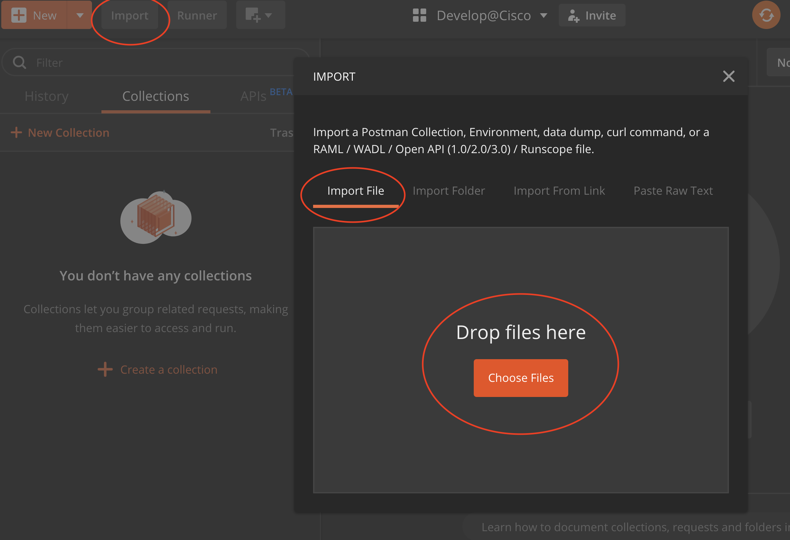
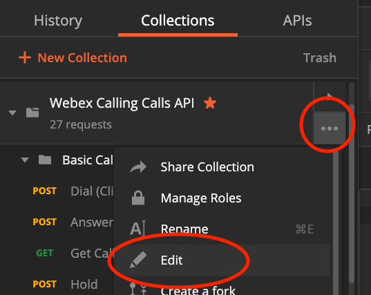
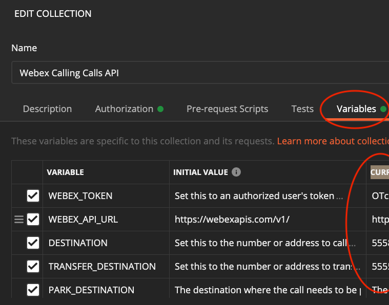
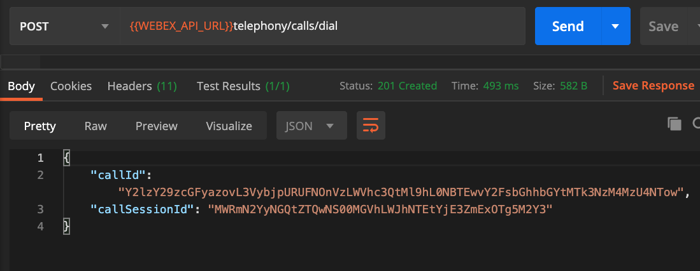

# webex-calling-api-examples
This repo provides a Postman collection that demonstrates the use of the [Webex Calling API](https://developer.webex.com/docs/api/guides/webex-calling).

To excercise these API simply do the following
* [Install Postman](https://www.postman.com/downloads/)
* [Import the collection](#import-the-collection)
* [Configure the environment](#configure-the-environment)
* [Exercise the requests](#exercise-the-resquests)

## Import the collection
1) Clone this repo or simply download the [postman collection](./webex-calling-calls-api.json) to your local disk.
2) From within Postman , begin by clicking the "Import" button, and choosing the "Choose Files" button:

  

When imported succesfully you should see new collection called "Webex Calling Calls API" in postman.

## Configure the Environment

This collection uses "collection level" variables, which simply means that you can specify an environment that is unique to you, directly from within the collection itself.  For the WEBEX_TOKEN variables defined, each token is an OAuth token for a user configured for calling in the test environment, and the token requires the calling scopes (spark:calls_read and spark:calls_write).

The environment variables are:

* WEBEX_TOKEN -- an OAuth token for a user.  To get started quickly, developers can copy their temporary token from the [Webex For Developers Gettings Started Guide](https://developer.webex.com/docs/api/getting-started#accounts-and-authentication).
* WEBEX_TOKEN_USER_B -- An OAuth token for another user, User B.  This token is used within the Mute Transfer & Transmit DTMF tests that perform a call action for User B "[for B]", and the Executive Assistant Call Push tests that perform a call action for the Executive "[for Executive]".
* WEBEX_TOKEN_USER_C -- An OAuth token for another user, User C.  This token is used within the Mute Transfer tests that perform a call action for User C "[for C]", and the Executive Assistant Call Push tests that perform a call action for the Assistant "[for Assistant]".
* WEBEX_API_URL -- the URL of the meetings API under test, generally the default value of "https://webexapis.com/v1/" does not need to be changed
* DESTINATION -- the destination to be dialed. Destination can be extensions, PSTN numbers, FAC codes or SIP URI. The destination can be digits or a URI. Some examples for destination include: 1234, 2223334444, +12223334444, *73, tel:+12223334444, user@company.domain, sip:user@company.domain
* TRANSFER_DESTINATION -- the destination to be dialed. This is used to make a second call from the api user in order to transfer the call.
* EXEC_DESTINATION -- the destination of the Executive to be dialed. This will cause the Assistant to ring and ensure the rest of the scenario proceeds.
* PARK_DESTINATION  -- the destination to park the call.
* VOICE_MESSAGE_ID -- the voice message Id.  Used by the Voice Message APIs that require a message Id to perform the action.

To edit the variables first click on the "three dots" associated with the collection and select edit

  

Then click on the "Variables" tab and update the values in the "Current Value" column as you need to:

  

If you are familar with Postman's environments, its worth noting that you don't need to explicity set an environment to run these requests, since all the variables are set at the collection level.  If you do have an active environment that sets any of the environment variables used by this collection, the active environment variables will take precedence.

Click the update button and you are ready to try the requests.

## Exercise the requests

The collection consists of several folders, with each folder exercising one of the following use cases:

1) Execute Basic Call with Hold and Resume APIs.  Create an outbound (Click to Dial) Call and verify it is gettable and perform a basic Hold and Resume operation on the call.
2) Execute Answer Call and Transfer APIs.  Answer an inbound call (UserA calls apiUser), intiatate another call from the same user (apiUser calls UserB) and perform a Consult Transfer (i.e. apiUser transfers the call to connect UserA with UserB)
3) Execute Blind Transfer to Voicemail API.  Answer an inbound call (UserA calls apiUser) and blind transfer (Divert) the call to apiUser's voicemail.
4) Execute Call Park and Retrieve APIs.  Answer an inbound call, park the call on another destination and retrieve the call back to apiUser.
5) Execute Call Recording APIs.  Answer an inbound call, start recording, the pause recording, resume recording and stop call recording and then end the call.
**Note:** The apiUser must be enabled for Call Recording in Control Hub and should have "On Demand" Call Recording option selected. Also, the apiUser information must be provisioned the Dubber account (i.e. user and dub point should be created prior to using these APIs)
6) Execute Get Call History APIs (i.e. missed calls, placed calls and received calls).
7) Execute Voice Messages APIs (example usage of the voice message APIs).
8) Execute Mute Transfer API.  Create an outbound call from User A (Click to Dial) to User B, verify the callId can be obtained, and then once a call is established between the two, Mute Transfer (MuteTransfer) the call from User A to User C.
9) Execute Transmit DTMF API.  Create an outbound call from User A (Click to Dial) to User B, verify the callId can be obtained, and then once a call is established between the two, Transmit DTMF Digits(TransmitDtmf) **1,234** from User A to User B.
10) Execute Executive Assistant Call Push API.  Create an outbound call from User A (Click to Dial) to the Assistant User (please ensure the user is configured to have the ExecutiveAssistant Service set up), verify the callId can be obtained, and then once a call is established between the two, the Executive Assistant User will push the call to the Executive (ExecutiveAssistantCallPush), who will then pick up the call.

Each folder is standalone, but the requests are meant to be run one after the other.

After sending the request scroll down to see the response.  The "Test Results" section will provide information on which tests passed (or failed).

  

Inspect the request and respone to better understand how the API works and move on to the next request in the folder.

The last request in each folder will run a pre-request script that will "clean up" the temporary environment variables that were set and used in the pre-request and test script.

Have fun!
